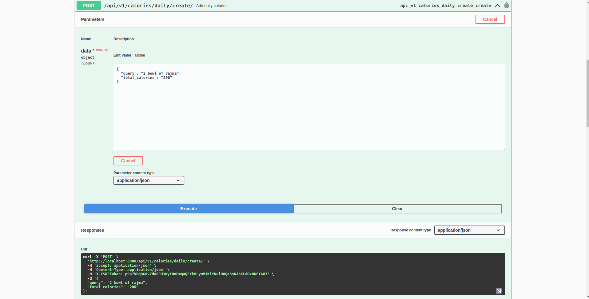
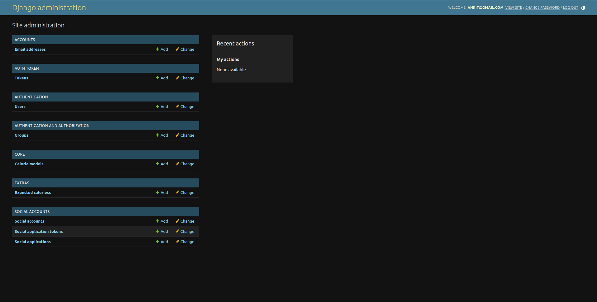

# CalorieCount Project

## Overview

The CalorieCount project is a Django-based API designed to manage calorie intake and provide users with a platform to track their daily consumption. The API offers various features such as user authentication, Google OAuth integration, Swagger UI for documentation, role-based permissions, and integration with a Calories API provider for retrieving calorie information.

## Features

- **User Authentication**: Users can create an account and log in securely.
- **Google OAuth**: Integration with Google OAuth for streamlined authentication.
- **Role-based Permissions**: Three roles implemented with different permission levels: regular user, user manager, and admin.
- **CRUD Operations**: Users can perform CRUD operations on their owned records, user managers can CRUD only users, and admins can CRUD all records and users.
- **Calorie Tracking**: Each entry includes a date, time, text description, and number of calories. If the calorie count is not provided, the API fetches it from a Calories API provider.
- **User Settings**: Users can set their expected number of calories per day.
- **Daily Total Analysis**: Each entry includes a boolean field indicating if the total calories for that day are less than the expected number of calories per day.
- **Filtering and Pagination**: Endpoints supporting list of elements provide filtering capabilities and support pagination.
- **Python Web Framework**: Built using a Python web framework for efficient development.
- **SQLite Database**: Utilizes SQLite as the database for simplicity and ease of deployment.

## Usage

### Installation
   
1. Clone the repository:
   ```bash
   https://github.com/AnkitJain78/CalorieCount.git
   cd CalorieCount

2. Install dependencies:

   ```bash
   pip install -r requirements.txt

3. Create a .env file in the root directory and define variables:

   ```plaintext
   Go to https://www.nutritionix.com and create your api key.

4. Migrate database schema:

   ```bash
   python3 manage.py makemigrations --settings "api.settings.local"
   python3 manage.py migrate --settings "api.settings.local"

5. Run the server
   ```bash
   python3 manage.py runserver --settings "api.settings.local"

5. Open your web browser and go to http://localhost:8000/docs/swagger to view the api documentation.
   
6. Authenticate using username & password or Google OAuth and use the api.

7. Create super user using command _python3 manage.py createsuperuser --settings "api.settings.local"_ and login to admin portal by /admin endpoint.


## Screenshots







## License

This project is licensed under the MIT License - see the [LICENSE](LICENSE) file for details.
